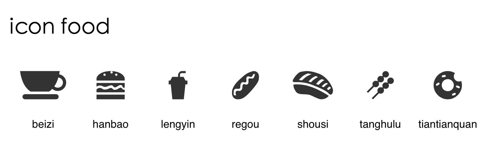

# edp-build iconfont demo

> edp build iconfont from svgs

## PreInstall

```
$ npm install -g edp
```

## Usage

```
$ git clone https://github.com/junmer/edp-build-iconfont-demo
$ cd edp-build-iconfont-demo
$ npm install edp-build-iconfont --save-dev
$ edp build -f --stage=iconfont
```

## Config

```
var IconProcessor = require('edp-build-iconfont');

exports.getProcessors = function () {

    var iconProcessor = new IconProcessor({
        files: 'src/svg/*.svg',         // svg 文件
        fontName: 'icon-food',          // 字体名
        dest: 'src/font'                // 目标路径
    });

    return {
        'iconfont': [iconProcessor]
    };

};
```

## Showcase

```
$ edp webserver start
```

打开 `http://127.0.01:8848/` 看效果



## Related

- [edp](https://github.com/ecomfe/edp)
- [fontmin](https://github.com/ecomfe/fontmin)
- [edp-build-iconfont](https://github.com/ecomfe/edp-build-iconfont)
- [fonteditor](https://github.com/ecomfe/fonteditor)

